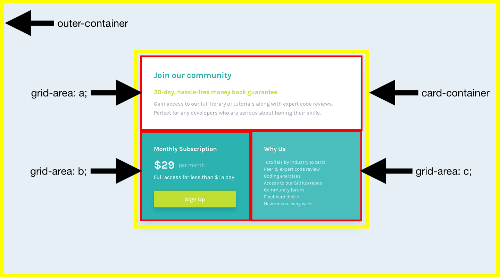

### Links

- Solution URL: [https://www.frontendmentor.io/solutions/single-price-grid-component-html-css-js-text-change-o9JH20aUYx]
- Live Site URL: [https://smgy94.github.io/frontend-mentor-single-price-grid-component-master/]

# Frontend Mentor - Single price grid component solution

This is a solution to the [Single price grid component challenge on Frontend Mentor](https://www.frontendmentor.io/challenges/single-price-grid-component-5ce41129d0ff452fec5abbbc). Frontend Mentor challenges help you improve your coding skills by building realistic projects.

## Table of contents

- [Links](#links)
- [Screenshot](#screenshot)
- [My process](#my-process)
- [Built with](#built-with)
- [What I learned](#what-i-learned)
- [Useful resources](#useful-resources)
- [Author](#author)

### Screenshot

Desktop

Mobile

## My process

I opened the desktop design in Adobe Photoshop and then I broke the design down into different containers using yellow & red boxes. This is a visual aid that I allows me to see how I'm going to layout the different elements on the page using CSS Grid / Flexbox.

### Built with

- Semantic HTML5 markup
- CSS custom properties
- Flexbox
- CSS Grid
- Javascript

### What I learned

I learned how to use Javascript to make change the text of a HTML element on mouseover using innerHTML.

### Useful resources

- [HTML DOM Element innerHTML](https://www.w3schools.com/jsref/prop_html_innerhtml.asp) - This helped me to change the button text on mouseover.

## Author

- Frontend Mentor - [@Smgy94](https://www.frontendmentor.io/profile/Smgy94)
- LinkedIn - (https://www.linkedin.com/in/shanemcgeown/)
- Twitter - (https://twitter.com/ShaneMcGeown94)
